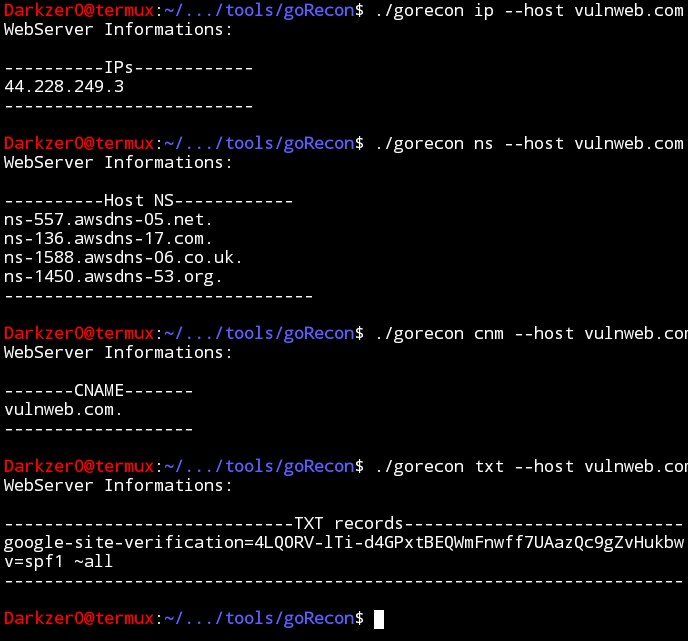

# goRecon
A Go command-line tool for basic web server reconnaissance. Quickly lookup IPs and Name Servers for any domain straight from your terminal.

Built with `github.com/urfave/cli v1`.

### **Installation (TERMUX/LINUX)**

```bash
apt install git -y
apt install golang -y
git clone https://github.com/DarkZer010/goRecon.git
cd goRecon
go mod tidy
go build
```
### **How to Use**

```bash
./gorecon [command] --host [domain]
```
| Command | Description | Example |
| --- | --- | --- |
| `ip` | Lookup all A and AAAA records for the domain | `./gorecon ip --host google.com.br` |
| `servername` | Lookup NS records for the domain | `./gorecon servername --host google.com.br` |


